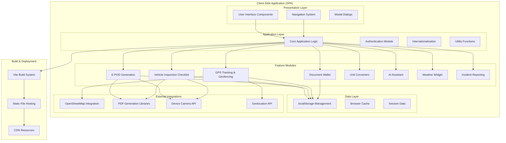

# HGV Driver Tools - System Architecture & Component Breakdown

## Executive Summary

The HGV Driver Tools application is a client-side, static Single Page Application (SPA) designed specifically for Heavy Goods Vehicle (HGV) drivers operating in the UK/EU logistics industry. The system provides a comprehensive suite of digital tools that replace traditional paper-based processes, enabling drivers to perform vehicle inspections, generate electronic proof of delivery (E-POD), track GPS locations, manage documents, and access various utility tools - all while operating entirely offline with local data storage.

## System Architecture Overview



## Technology Stack

### Frontend Framework
- **Architecture**: Single Page Application (SPA)
- **Build Tool**: Vite v5.4.8
- **Languages**: HTML5, CSS3, Vanilla JavaScript (ES6+)
- **Styling**: Custom CSS with responsive design
- **Fonts**: Google Fonts (Sora font family)

### Core Dependencies
- **PDF Generation**: jsPDF v2.5.1, PDF-lib v1.17.1
- **Mapping**: Leaflet v1.9.4 (OpenStreetMap integration)
- **Development**: Vite v5.4.8

### Browser APIs Utilized
- **Geolocation API**: GPS tracking and location services
- **MediaDevices API**: Camera access for photo capture
- **Canvas API**: Signature capture and image processing
- **FileReader API**: Document upload and processing
- **localStorage API**: Client-side data persistence

## Component Architecture

### 1. Core Application Module

**File**: `script.js` (Main application logic)

**Responsibilities**:
- Application initialization and lifecycle management
- Navigation system control
- Internationalization (i18n) support
- Utility function management
- Cross-module communication

**Key Functions**:
```javascript
// Application initialization
document.addEventListener('DOMContentLoaded', function() {
    autoPopulateDateTimeFields();
    initializeSignatureCanvas();
    initializeGPSTracking();
    initializeGeofencing();
    // ... other initializations
});

// Navigation system
function showSection(sectionId) { /* Section switching logic */ }
function changeLanguage(lang) { /* i18n implementation */ }
```

### 2. Vehicle Inspection Checklist Module

**Purpose**: Digital replacement for paper-based vehicle walkaround inspections

**Features**:
- Comprehensive vehicle inspection checklist
- Photo capture for defect documentation
- Digital signature capture
- PDF report generation
- Multi-language support

**Data Storage**:
```javascript
// localStorage keys
'walkaroundChecklist_YYYY-MM-DD'
'checklistImages_YYYY-MM-DD'
'checklistSignature_YYYY-MM-DD'
```

**Key Functions**:
- `generateWalkaroundPDF()`: Creates inspection reports
- `handleSectionImageUpload()`: Manages photo capture
- `initializeSignatureCanvas()`: Signature functionality

### 3. E-POD (Electronic Proof of Delivery) Module

**Purpose**: Digital delivery confirmation with document overlay capabilities

**Features**:
- PDF document upload and overlay
- Digital signature placement
- Image overlay functionality
- Email integration (client-side)
- Multi-step workflow

**Workflow**:
1. Upload delivery note PDF
2. Capture recipient signature
3. Add delivery photos
4. Generate signed E-POD
5. Export/email document

**Key Functions**:
- `loadEPODPDF()`: PDF processing
- `applyEPODSignature()`: Signature application
- `saveEPODPDF()`: Final document generation

### 4. GPS Tracking & Geofencing Module

**Purpose**: Real-time location tracking with geofence monitoring

**Features**:
- Real-time GPS tracking
- Geofence creation and monitoring
- Location sharing with time limits
- Distance calculations
- Route visualization

**Geofencing Capabilities**:
```javascript
// Geofence structure
{
    id: 'geo_' + timestamp,
    name: 'Zone Name',
    type: 'delivery|pickup|rest|custom',
    latitude: 51.5074,
    longitude: -0.1278,
    radius: 100, // meters
    enabled: true,
    autoNotify: false,
    notifyMinutesBefore: 5
}
```

**Key Functions**:
- `startTracking()`: GPS monitoring
- `createGeofence()`: Geofence creation
- `checkGeofences()`: Real-time monitoring
- `shareTrackingLink()`: Location sharing

### 5. Document Wallet Module

**Purpose**: Centralized document management system

**Features**:
- Document upload and categorization
- Search and filtering
- Expiry date tracking
- Document preview
- Export capabilities

**Document Categories**:
- Driver Licenses
- Vehicle Documents
- Insurance Certificates
- Training Certificates
- Route Planning
- Maintenance Records

**Storage Structure**:
```javascript
// Document metadata
{
    name: 'Document Name',
    type: 'pdf|image|document',
    category: 'license|vehicle|insurance',
    uploadDate: '2025-01-15',
    expiryDate: '2026-01-15',
    size: 1024000,
    tags: ['urgent', 'renewal']
}
```

### 6. Unit Converters Module

**Purpose**: Comprehensive unit conversion tools for logistics operations

**Supported Conversions**:
- **Currency**: GBP, EUR, USD with real-time rates
- **Length**: Metric/Imperial conversions
- **Weight**: Kilograms, pounds, tons
- **Volume**: Liters, gallons, cubic meters
- **Temperature**: Celsius, Fahrenheit, Kelvin
- **Speed**: MPH, KPH, knots
- **Pressure**: PSI, bar, kPa
- **Area**: Square meters, square feet, acres
- **Fuel**: Liters, gallons, efficiency calculations
- **Time**: Hours, minutes, working time calculations

**Calculator Features**:
- Memory functions (M+, M-, MR, MC)
- Scientific calculator operations
- Load calculations for HGV compliance
- Working hours calculator (EU driving regulations)

### 7. AI Assistant Module

**Purpose**: Mock AI assistant for driver support and guidance

**Features**:
- Context-aware responses
- Quick question templates
- Regulatory guidance
- Route optimization suggestions
- Emergency contact assistance

**Response Categories**:
- Vehicle maintenance queries
- Route planning assistance
- Regulatory compliance questions
- Emergency procedures
- Weather-related advice

### 8. Weather Widget Module

**Purpose**: Real-time weather information for route planning

**Features**:
- Current weather conditions
- Location-based weather data
- Weather alerts and warnings
- Route weather forecasting
- Offline weather data fallback

**Data Sources**:
- OpenWeatherMap API (when online)
- Cached weather data (offline mode)
- GPS location integration

### 9. Incident Reporting Module

**Purpose**: Digital incident documentation and reporting

**Features**:
- Incident type categorization
- Photo documentation
- Digital signature capture
- GPS location tagging
- PDF report generation

**Incident Types**:
- Vehicle breakdown
- Traffic accident
- Delivery issues
- Weather-related incidents
- Security incidents

## Data Architecture

### Storage Strategy

**Primary Storage**: Browser localStorage
- **Advantages**: Offline operation, fast access, no network dependency
- **Limitations**: Storage size limits (~5-10MB), device-specific

**Data Categories**:
1. **User Profile Data**: Driver information, preferences, settings
2. **Application Data**: Checklists, E-PODs, tracking history
3. **Document Storage**: Uploaded files, generated reports
4. **Configuration**: App settings, language preferences, UI state

### Data Persistence Patterns

```javascript
// Profile data structure
const profileData = {
    driverName: 'John Smith',
    vehicleReg: 'AB12 CDE',
    companyName: 'Logistics Ltd',
    phoneNumber: '+44 123 456 7890',
    email: 'john.smith@logistics.com'
};

// Checklist data structure
const checklistData = {
    date: '2025-01-15',
    vehicleReg: 'AB12 CDE',
    driverName: 'John Smith',
    sections: [
        {
            name: 'Exterior Checks',
            items: [
                { name: 'Lights', status: 'pass', defects: '', images: [] },
                { name: 'Tyres', status: 'fail', defects: 'Tyre pressure low', images: ['img1.jpg'] }
            ]
        }
    ],
    signature: 'data:image/png;base64,...',
    timestamp: '2025-01-15T08:30:00Z'
};
```

### Data Export/Import

**Export Capabilities**:
- JSON format for data backup
- PDF reports for documentation
- CSV format for analysis
- Image exports for visual records

**Import Capabilities**:
- Profile data restoration
- Document uploads
- Configuration imports

## Security Architecture

### Client-Side Security

**Data Protection**:
- localStorage encryption (planned)
- Session timeout management
- Secure data export/import

**Access Control**:
- Authentication system (basic implementation)
- Session management
- Role-based access (driver/admin)

**Privacy Considerations**:
- GPS data handling
- Photo capture permissions
- Document storage security

## Performance Architecture

### Optimization Strategies

**Loading Performance**:
- Vite build optimization
- Code splitting by modules
- Lazy loading for heavy components
- Image compression and optimization

**Runtime Performance**:
- Efficient localStorage operations
- Debounced GPS updates
- Optimized PDF generation
- Memory management for large files

**Mobile Optimization**:
- Touch-friendly interface
- Responsive design
- Battery-efficient GPS usage
- Offline-first architecture

## Deployment Architecture

### Build Process


**Build Configuration** (`vite.config.js`):
```javascript
export default defineConfig({
    plugins: [],
    server: {
        host: '0.0.0.0',
        hmr: true
    }
})
```

### Deployment Options

1. **Static Hosting**: Netlify, Vercel, GitHub Pages
2. **CDN Distribution**: Global content delivery
3. **PWA Deployment**: Progressive Web App capabilities
4. **Container Deployment**: Docker containerization

## Scalability Considerations

### Current Limitations

**Storage Constraints**:
- localStorage size limits
- No cross-device synchronization
- Limited offline data retention

**Performance Constraints**:
- Single-threaded JavaScript execution
- Browser memory limitations
- PDF processing overhead

### Future Expansion Path

**Backend Integration**:
- Cloud database for data persistence
- Real-time synchronization
- Multi-device support
- Advanced analytics

**API Integrations**:
- Real AI services (OpenAI, Google AI)
- Live weather APIs
- Traffic data integration
- Fleet management systems

**Advanced Features**:
- Real-time collaboration
- Advanced reporting
- Machine learning insights
- IoT device integration

## Compliance & Regulatory Considerations

### UK/EU HGV Regulations

**Driver Hours Compliance**:
- EU driving time regulations
- Rest period tracking
- Working time directive compliance
- Digital tachograph integration

**Vehicle Safety**:
- Daily walkaround inspection requirements
- Defect reporting procedures
- Maintenance record keeping
- Safety documentation

**Documentation Requirements**:
- E-POD legal compliance
- Digital signature validity
- Audit trail maintenance
- Data retention policies

## Monitoring & Analytics

### Application Metrics

**Performance Monitoring**:
- Page load times
- GPS accuracy metrics
- PDF generation performance
- Storage usage statistics

**User Analytics**:
- Feature usage patterns
- Error tracking
- User journey analysis
- Performance bottlenecks

**Business Intelligence**:
- Driver efficiency metrics
- Route optimization data
- Compliance reporting
- Cost analysis

## Conclusion

The HGV Driver Tools application represents a modern, client-side solution for digitizing traditional paper-based logistics processes. The architecture prioritizes offline functionality, user experience, and regulatory compliance while maintaining the flexibility for future backend integration and advanced feature development.

The modular design allows for independent development and testing of individual components, while the comprehensive data management system ensures reliable operation in challenging network conditions typical of logistics operations.

Future development should focus on backend integration for enhanced data persistence, real-time collaboration features, and advanced AI-powered assistance capabilities.
